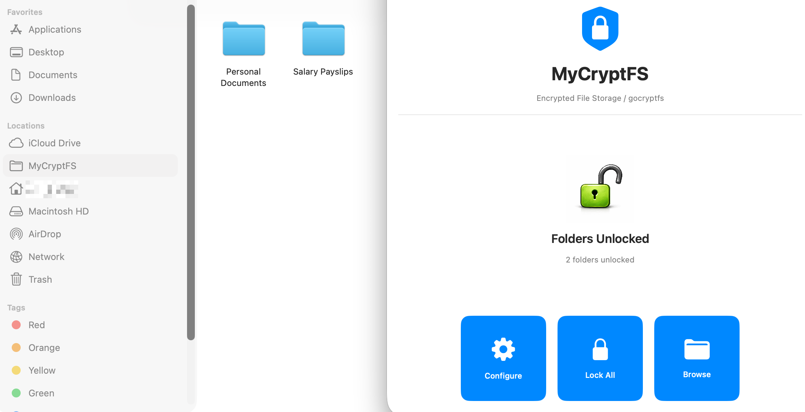
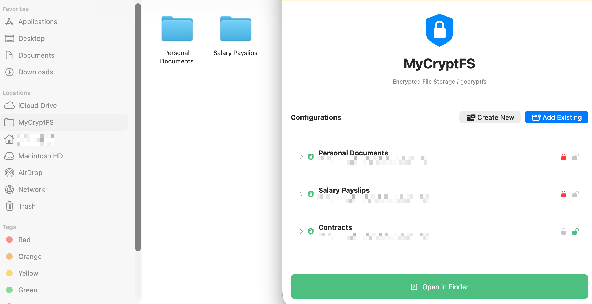
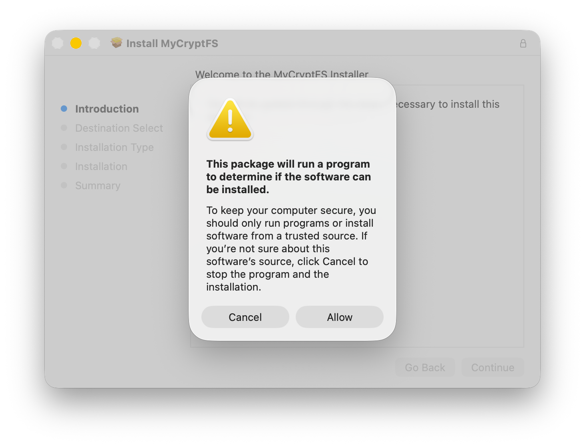

# MyCryptFS

*An unofficial macOS client for `gocryptfs` encrypted containers with native Finder integration.*

```
⚠︎ this app is NOT vibecoded 🖐️
```

## About

I got tired of waiting for `gocryptfs` client with proper macOS support, so I built this for my own needs. Sharing it in case others have the same problem.

**gocryptfs** is an open-source encrypted filesystem. It encrypts your files on disk while providing transparent access to decrypted content. The official gocryptfs tools work great on Linux, but macOS users have been stuck with command-line solutions or FUSE mounts that don't integrate well with Finder.

Thanks to `gocryptfs`, your encrypted data can be accessed using other compatible software on different platforms, providing freedom from vendor lock-in.

> **MyCryptFS** brings `gocryptfs` to macOS with proper Finder integration. Encrypted folders appear as native locations in Finder's sidebar, just like any other mounted volume.

| Dashboard | Configurations |
|-----------|----------------|
|  |  |

## Distribution

MyCryptFS is distributed as a binary package (see `§ Source Code` section below for details on source availability). This project is built on the belief that everyone has an equal right to have their own sensitive data additionally protected, thus distributed free of charge.

The software is distributed as is (see LICENSE) with no obligations and responsibilities on the part of the author.

## Features

- **Native Finder Integration**: Encrypted folders appear as locations in Finder sidebar
- **Multiple Volumes**: Mount multiple encrypted folders simultaneously
- **Short-term Secure Password Storage**: Passwords stored for a short time in macOS Keychain
- **Create New Volumes**: Create new encrypted filesystems directly from the app
- **Works with Existing Volumes**: Compatible (see `§ Limitations`) with gocryptfs volumes created on Linux or other platforms

## App ↔ File Provider Architecture

MyCryptFS uses Apple's File Provider framework, which requires a two-part architecture:

**Main Application** 
- Resides in `/Applications` folder
- Provides the user interface for managing configurations
- Handles password entry and Keychain storage
- Creates new encrypted filesystems
- Registers and activates File Provider domains with macOS

**File Provider Extension** (background service)
- Runs as a separate process managed by macOS
- Performs the actual file decryption using gocryptfs
- Handles all filesystem operations (reading files, listing directories)
- Integrates with Finder to provide seamless access

The file provider extension runs separately to maintain security isolation and allow macOS to manage the filesystem lifecycle. Settings are configured in the main app, and macOS automatically handles mounting and Finder integration in the background.

## Requirements

- macOS 26.0 or later (macOS Sequoia)
- Apple Silicon Mac

## Installation

### Via Homebrew

Coming soon...

### Direct Installation

1. Download the latest `.pkg` file from the Releases page
2. Double-click to install
3. Find MyCryptFS in Applications folder

> **Note on Installation Warning**
>
> Based on experience with Apple's File Provider framework becoming unstable and stale (with pain to fix), the current package contains built-in logic to check if MyCryptFS is running and require it to be quit before installation. This triggers a warning during installation (see screenshot below) which might confuse.
>
> 
>
> If you want to inspect this logic yourself, you can expand the package contents:
> ```bash
> pkgutil --expand ~/Downloads/path/to/mycryptfs.pkg /tmp/mycryptfs-expanded
> ```
>
> The next release will be probably shipped with a check-free version of the package.


### First Launch

After installation:
1. Launch MyCryptFS from Applications
2. Click "Configure" to add your first encrypted folder
3. Browse to select an encrypted gocryptfs folder (or create a new one)
4. Enter the password (stored securely in Keychain)
5. Click "Unlock" to mount the volume
6. Open Finder - your decrypted files appear in the sidebar under "MyCryptFS"

## Usage

Once a folder is unlocked, it appears in Finder's sidebar under "MyCryptFS". It can be navigated like any other folder. All files are transparently encrypted and decrypted while accessing them.

For security and stability reasons, the folders remain unlocked as long as (and not locked manually) the main app runs.

## Limitations

**Beta Status**

This software is considered beta quality. While it has been used for some time without issues, there is still a risk of data loss or corruption. Regular backups of encrypted data are essential. Always maintain backups of encrypted data. Use at own risk.

The underlying configuration format is subject to change between versions, which may affect the appearance or availability of previously added encrypted folders after an update.

**Configuration Limitations**

- Advanced gocryptfs settings are not supported
- Filesystems created with simple `gocryptfs -init` command are supported only
- The app's "Create New Encrypted Filesystem" feature is recommended for best compatibility

**Personal Project**

This is a personal hobby project built to solve specific needs. It works for its intended use cases, but may have bugs or incomplete features as well as custom priorities for the project's roadmap.

## Source Code

I understand and support the principle that applications handling sensitive data should have publicly available source code for audit and verification. Currently, the source code for MyCryptFS is not available.

I consider publishing the sources for audit reasons, but I cannot commit to a specific timeline or make any promises about when this will happen. It depends on available resources and time.

**Security Considerations**

In the meantime, here are some facts about the application's security model:
- **Code Signed and Notarized**: The application is signed and notarized by Apple, ensuring it hasn't been tampered with and meets Apple's security requirements
- **Fully Sandboxed**: MyCryptFS runs in Apple's App Sandbox with restricted permissions
- **No Network Connectivity**: The application intentionally has no network capabilities and makes no outbound connections
- **No System Logs**: The application does not produce system logs *at all* that could be used against the user. This does make issue investigation harder - when reporting bugs, clear descriptions and exact steps to reproduce are essential

**Recommended Precautions**

Until the source code is published, users are strongly encouraged to:
- Monitor the application with firewalls (e.g., Little Snitch, Lulu) to verify no network activity
- Use macOS's built-in security features to restrict the app's permissions
- Apply any additional restrictions as needed for comfort level
- Maintain regular backups of encrypted data (this is recommended practice regardless)
- Only use this software if comfortable with these limitations

This is a significant trust consideration, especially for encryption software. The decision to use closed-source software with sensitive data must be made individually.

## Threat Model

MyCryptFS (so `gocryptfs`) is designed to protect data at rest - specifically, to prevent access to encrypted files by anyone who does not have the password. This includes protection against physical device theft, unauthorized access to the storage medium, or access to files when the volume is locked.

However, MyCryptFS assumes the user trusts the environment in which the app operates. Once a folder is unlocked, the decrypted contents are accessible to the active user session. Since other processes running on the system under the same user account have equivalent file access permissions, MyCryptFS does not and cannot protect against malicious software already running in the same user session.

As a signed application, MyCryptFS relies on the operating system to enforce the integrity of its data and memory. macOS prevents other processes from inspecting or tampering with a signed app's memory space, which means the app's internal state - including passwords and decrypted content held in memory - is protected by the OS at the process level.

**In short**: MyCryptFS/gocryptfs protects data when locked. It does not protect data from processes that share the same system access as the user who unlocked it.

## Reporting Issues

If you encounter bugs or have suggestions:

1. Check the [Issues](../../issues) page to see if it's already reported
2. Open a new issue with clear details about the problem
3. Include your macOS version, MyCryptFS version, and steps to reproduce

**Please understand**: This is a personal project maintained in my spare time. I may not be able to respond immediately or address all issues. I prioritize problems that affect my own usage, but I do review all reports.

## Support the Project

If MyCryptFS is useful, there are meaningful ways to support the project - from spreading the word to educating others about encryption. See [SUPPORT.md](SUPPORT.md) for details on how to help.

## License

Copyright (c) 2026 Andrew Sichevoi. All rights reserved.

This software is provided for personal use. No warranty is provided. Use at your own risk.
